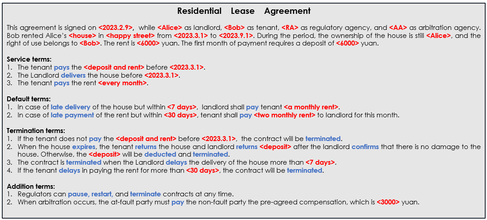
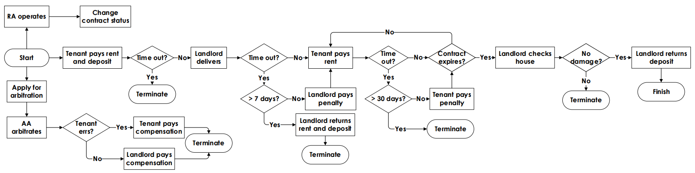
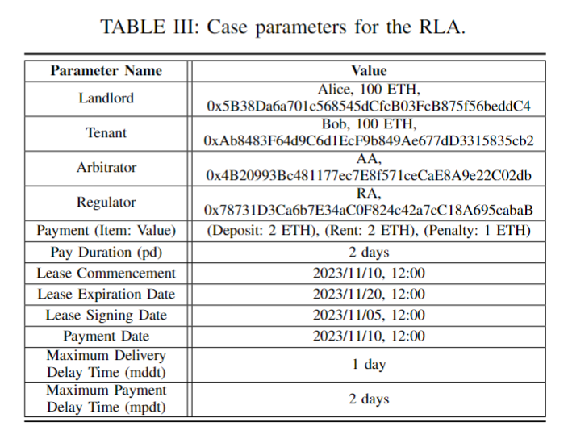
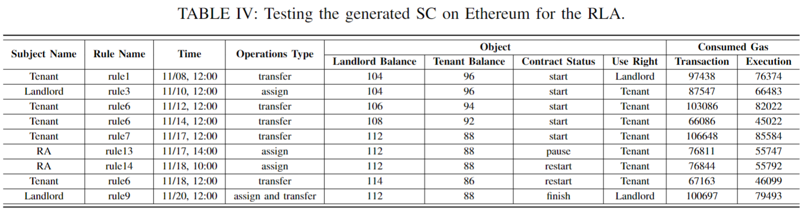

# Residential Lease Agreement (RLA) Case Study

## Overview

This repository showcases a case study demonstrating how to translate a Residential Lease Agreement (RLA) into a Smart Contract (SC) using our Sparrow framework. The case study includes a detailed description of the RLA, its Smart Legal Contract (SLC) representation, and the automatically generated Solidity SC, complete with deployment tests.

## Table of Contents

- [RLA Overview](#rla-overview)
- [Specification of RLA](#specification-of-rla)
- [Generated Smart Contract](#generated-smart-contract)
- [Deployment Test](#deployment-test)

## RLA Overview

The RLA utilized in this case study is based on the version referenced in [SPESC-translator](#), enhanced with additional roles and terms that are typically included but often overlooked. The RLA comprises the following key components:

- **Service Terms**: Obligations such as initial payments, property delivery, and monthly rent.
- **Default Terms**: Conditions triggered by delays, including late house delivery and rent payments.
- **Termination Terms**: Circumstances under which the lease may be terminated, such as significant delays or property damage.
- **Additional Terms**: Regulatory oversight and arbitration processes independent of external events.
  

## Specification of RLA

The SLC specification simplifies the modeling process by encapsulating redundant expressions of similar contractual clauses. The translated SLC of RLA is at `HouseRent.sparrow`.

## Generated Smart Contract

The SLC specification is automatically translated into Solidity, adhering to predefined rules without the need for manual refinement. The generated smart contract of RLA is at `HouseRent.sol`.

## Deployment Test
We conducted deployment tests to validate the generated SC against the original LC. Using Remix IDE, the SC was compiled and deployed on Ethereum. The flowchart illustrates the business process of the RLA.`

### Test Parameters
The parameters for the RLA case study are outlined in the below table, which include testing details on involved parties, payments, and lease dates.

### Test Scenarios

- On 11/08, the tenant initiates the first rent and deposit payment.
- On 11/10, the landlord delivers the house.
- On 11/12, the tenant pays regular rent.
- On 11/14, the tenant pays regular rent.
- On 11/17 at 12:00, the tenant pays the rent late, incurring fines.
- On 11/17 at 14:00, the regulator suspends the contract.
- On 11/18 at 10:00, the regulator resumes the contract.
- On 11/18 at 12:00, the tenant pays regular rent.
- On 11/20, the contract expires, prompting the landlord to return the deposit and reclaim the house.

### Test Results
The tests confirm the correct execution of the contract logic. Below are some results:

## Conclusion
This case study successfully demonstrates the translation of a RLA into a SC using the Sparrow framework, highlighting the advantages of automated contract generation. The generated SC operates seamlessly on Ethereum, adhering to the intended contractual logic.
