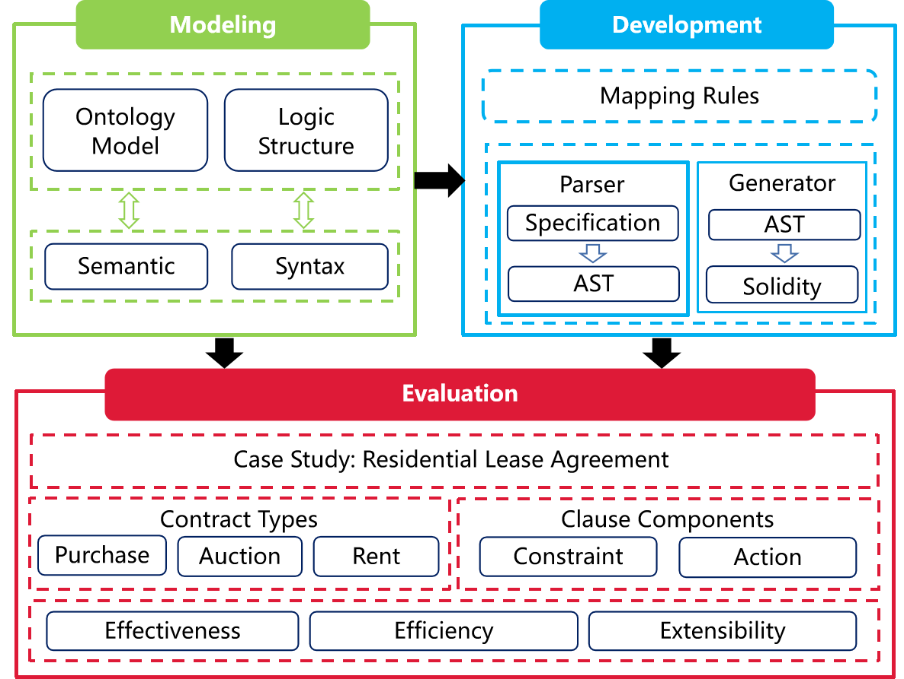
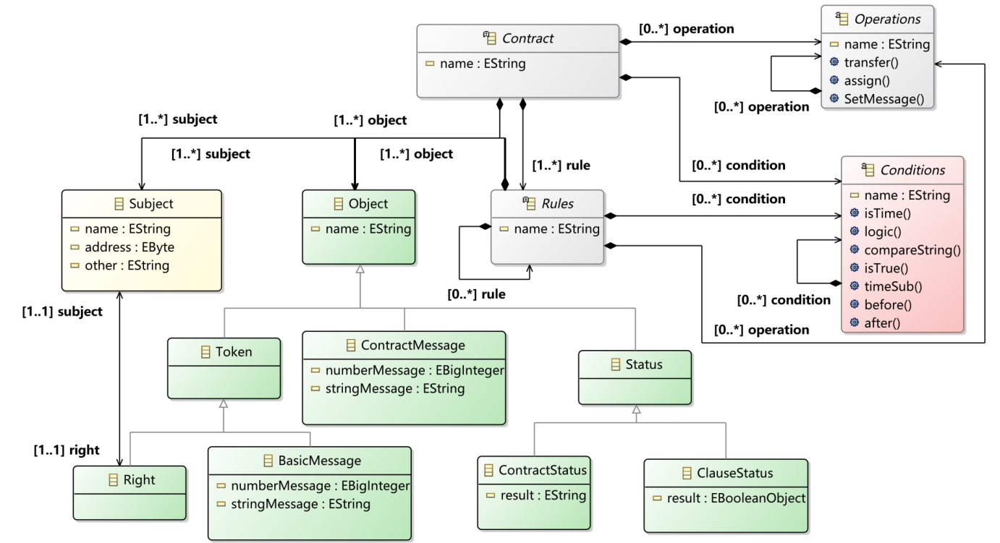

# Sparrow
## Introduction
Sparrow is an innovative framework designed to translate legal contracts (LCs) into efficient and complete smart contracts (SCs) on the Ethereum blockchain. Our system streamlines the process of Smart Legal Contract (SLC) design and development, ensuring enhanced expressiveness, concise code generation, and extensibility.

## Key Features

- **Model Design Module**: Utilizes an ontology model and logical process structure to formalize the semantics and syntax of legal contracts, minimizing ambiguity in natural language.
- **SLC Development Module**: Automates the generation of SLCs, mapping specifications to Solidity code with precision, ensuring code integrity and efficiency.
- **SLC Evaluation Module**: Conducts comprehensive testing and evaluation, comparing Sparrow's performance with existing solutions like CML and TA-SPESC.
  

## System Objectives

Sparrow is developed with clear objectives to address specific challenges in translating LCs into SCs:

1. **Effective Modeling and Development**: Sparrow should achieve effective semantic modeling of LCs to generate SLCs and automate the translation of those SLCs into SCs without requiring post-manual processing.
2. **Concise Code Generation**: Sparrow should generate concise codes to minimize gas consumption for deploying on the Ethereum blockchain. 
3. **Extensibility**: Sparrow should be capable of extensibility to satisfy new functional requirements and handle a large number of LCs.

## Core Ontology Components

Sparrow's ontology is structured around the following components:

- **Subject**: An enhanced set used to denote the functional roles involved in contract management, not only the primary contracting parties but also extend to other overlooked stakeholders such as authenticators, regulators, and arbitrators.
- **Object**: Targets the entities owned or triggered by the Subject, whether tangible or intangible, such as assets, messages, and status.
- **Conditions**: A unified set of logic structures that control the performance and validity of contracts, without distinguishing between preconditions and postconditions.
- **Operations**: Actions emitted by defined roles in the Subject, describing corresponding rights and obligations within the contract.
- **Rules**: A composite set of terms covering essential elements like payment terms, delivery schedules, rights and obligations, dispute resolution, warranties, and other pertinent aspects of legal contracts.

## Design Principles

Sparrow's ontology design follows the principles of:

- **Decoupling**: Separating functional sets to enhance modularity and reusability.
- **Aggregation**: Grouping related components to form coherent contract structures.
- **Encapsulation**: Sparrow encapsulates the internal logic of contract components for reuse and concise expression.
- **Polymorphism**: Leveraging polymorphism, Sparrow enables the same interface to support multiple underlying forms, allowing for more flexible and reusable contract elements.

By focusing on functional set construction rather than redundant processing, Sparrow's ontology is designed to be more reusable, manageable, and extensible.
   
## Setup and Usage Guide
To get started with the Sparrow Framework in Eclipse, follow these step-by-step instructions:

### Prerequisites
- Eclipse IDE (2022-04 or later version)
- Java Development Kit (JDK) installed

### Install Xtext Plugin
To work with Sparrow, you need to have the Xtext plugin installed in Eclipse. You can install it in one of two ways:

1. **Eclipse Marketplace**: Search for "Xtext" in the Eclipse Marketplace and follow the installation instructions.
2. **Direct Installation**: Configure your Eclipse installation to include DSL development tools. This will enable you to work with Domain-Specific Languages (DSLs) like Sparrow.

### Import Sparrow Project
1. Open Eclipse and select `File` > `Import`.
2. Choose `General` > `Existing Projects into Workspace` and click `Next`.
3. Browse to the location of the Sparrow project and follow the prompts to import it.

### Understanding the Project Structure
The main files of the Sparrow DSL project are located in the `org.xtext.example.sparrow` package. Here's a brief overview:

- `*.xtext` files: Define the syntax of the Sparrow DSL language.
- `*.xtend` files: Define the mapping rules between the Sparrow DSL language and other languages, such as Java or Solidity for smart contract generation.

### Running the Project
After importing the project, you can run Sparrow's integrated development environment (IDE) directly within Eclipse. This will allow you to:

- Write and test Sparrow DSL scripts.
- Generate smart contracts from your DSL scripts.
- Utilize the features of the Sparrow framework.

### Getting Started with Sparrow IDE
Once the project is running, you can start using the Sparrow IDE by:
1. Creating a new Sparrow DSL file or opening an existing one.
2. Writing your legal contract specifications in the DSL language.
3. Using the provided tools to generate and test smart contracts.

For more detailed information about Sparrow's syntactic semantic design and mapping rules, you can learn about it from the article "Sparrow: An Expressive and Extensible Domain-Specific Language for Translating Legal Contracts to Smart Contracts".

Enjoy developing with Sparrow!

## License

Sparrow source code files are made available under the [Apache License, Version 2.0](LICENSE). Sparrow documentation files are made available under the [Creative Commons Attribution 4.0 International License (CC-BY-4.0)](https://creativecommons.org/licenses/by/4.0/). 

All rights reserved. All trademarks referenced herein are the property of their respective owners. See [LF Projects Trademark Policy](https://lfprojects.org/trademark-policy/) for details.

