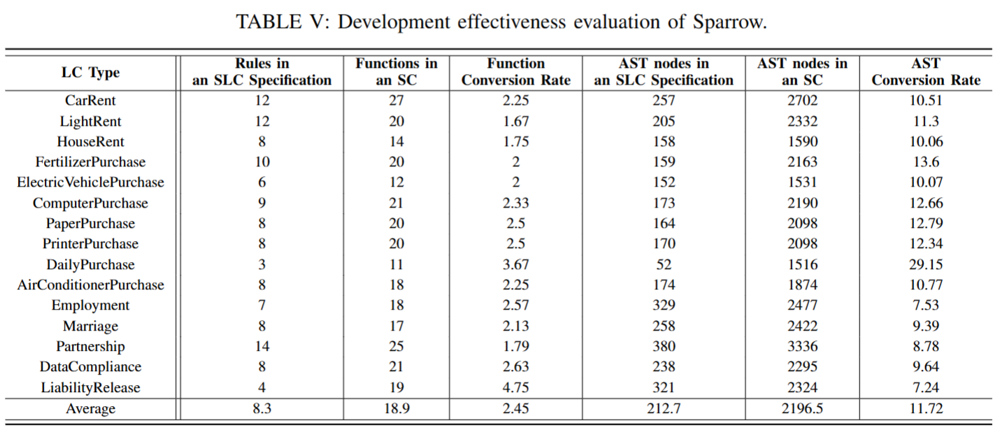

# Modeling and Development Effectiveness Evaluation
We evaluate the effectiveness of our Sparrow in terms of modeling effectiveness and development effectiveness.

## 1. Modeling Effectiveness
Modeling effectiveness evaluates how well Sparrow captures the semantics and syntax of legal elements within LCs. We specifically check:

- **Legal Elements**: Whether elements defined in LCs (e.g., Subject, Object, Operations) are accurately represented in the SLC specification.
- **Logical Structures**: Whether Conditions and Rules are expressed correctly.

In our analysis, we demonstrate that Sparrow effectively models legal elements and logical structures, using a RLA as a primary example. We constructed an evaluation dataset comprising 10 general LC types, including various lease and purchase contracts. These 10 contracts(under `dataset` directory) are also tested.

## 2. Development Effectiveness
Development effectiveness is measured by executing the deployed SCs to assess the need for post-processing and analyzing the mapping rules for functional completeness.

### Key Findings:
- Sparrow generates SCs directly from LCs without the need for post-manual refinement, significantly reducing manual intervention costs and improving generation efficiency.
- The function conversion rate averages at 2.18, indicating a positive correlation between the simplicity of LCs and the reuse of functions.
- We also assess the complexity of abstract syntactic structures via the number of Abstract Syntax Tree (AST) nodes, providing insights into the implementation detail of SCs compared to their SLC specifications.

 

### Security Analysis
While not the primary focus of this evaluation, we validate the security of the generated SCs using tools like Mythril, SmartCheck, and Slither. The results highlight potential vulnerabilities such as reentrancy and timestamp dependency. Mitigation strategies include employing reentrancy guards and refining the timestamp handling.

## Conclusion
Sparrow demonstrates strong modeling and development effectiveness in automating the generation of smart contracts from legal contracts. Although certain security considerations remain, the approach allows for efficient and automated contract deployment without requiring manual refinement.

