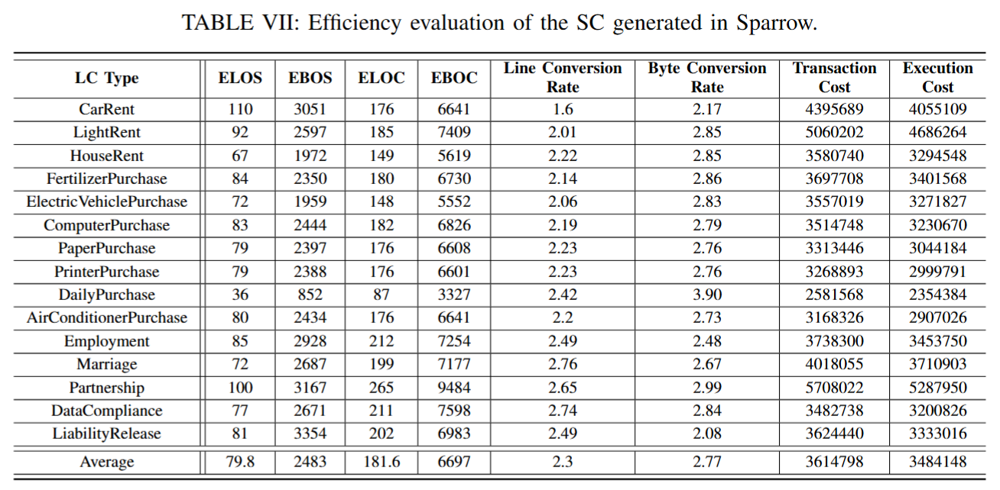

# RQ2: Efficiency of Sparrow
The efficiency of Sparrow is evaluated based on four primary criteria: **line conversion rate**, **byte conversion rate**, **conversion efficiency**, and **gas consumption**. 

## Efficiency Evaluation Criteria

1. **Line Conversion Rate (LCR)**: This is calculated as the ratio of Effective Lines of Code (ELOC) to Effective Lines of Specification (ELOS). A higher LCR indicates that more code can be derived from fewer lines of specification.

2. **Byte Conversion Rate (BCR)**: This ratio is derived from Effective Bytes of Code (EBOC) to Effective Bytes of Specification (EBOS). The BCR is often more reliable than the LCR as it provides a more precise measure of redundancy in the code.

3. **Conversion Efficiency**: This metric measures the number of bytes converted per unit of time, highlighting the overall efficiency of the development process.

4. **Gas Consumption**: Gas costs associated with transactions and execution are output by Remix IDE, reflecting the resources required for deploying and executing smart contracts on the Ethereum blockchain.

### Key Findings
From our evaluation, we observe the following:

- The degree of redundancy in the SLC specification can be quantified by EBOS and ELOS, while redundancy in the SC can be measured by ELOC and EBOC.
- Simpler LCs tend to produce less complex SLC specifications and SCs, leading to higher conversion rates.
- The average generation time for SCs is **27.5 ms**, and the average conversion efficiency is **258 bytes per millisecond**, indicating that Sparrow is feasible for practical use.
- Gas consumption is quantified with an average transaction cost of **3,613,841** and an average execution cost of **3,324,537**. This consumption is influenced by ELOC and EBOC, with higher values leading to increased gas costs for the same function.

## Conclusion
The evaluation results indicate that Sparrow demonstrates efficient performance in converting legal contracts into smart contracts, making it a practical tool for automating this process. The metrics highlight not only the efficiency of code generation but also the associated costs in terms of gas consumption, which is critical for real-world deployment on the Ethereum network.

