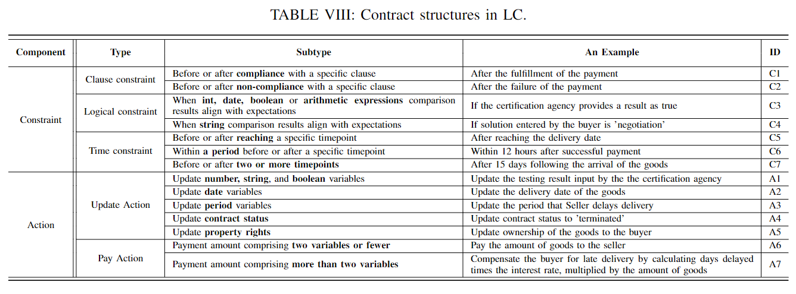
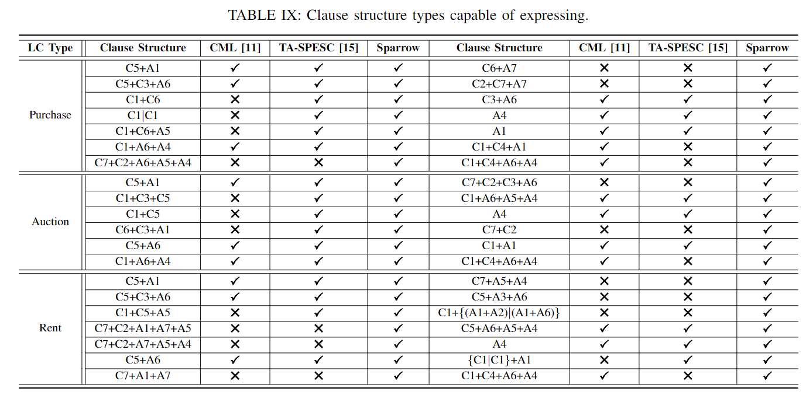
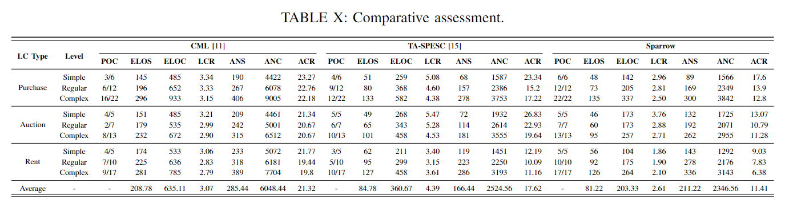

# RQ3: Extensibility of Sparrow
This repository presents the extensibility evaluation of Sparrow, showcasing its adaptability in modeling diverse LCs compared to selected baselines, such as CML and TA-SPESC. This evaluation is crucial for demonstrating Sparrow's capability to handle the dynamic growth of contract types and numbers effectively.

We assess the extensibility of Sparrow by comparing it with CML and TA-SPESC based on their functions and performance. Our analysis includes three types of LCs: **purchase contracts**, **auction contracts**, and **rent contracts**, categorized into three complexity levels: **simple**, **regular**, and **complex**. The complexity levels vary, with the regular level introducing property rights and fundamental breach of contract clauses, while the complex level adds diverse functional roles and intricate resolution clauses.

## Function Comparison

We evaluate the extensibility of Sparrow by examining its capability to express prevalent clauses found in LCs, which consist of constraints and actions. 
We have classified the catogories of clause structure types in Table VIII.

Due to space constraints, we present only the complex contract clause structures in Table IX.

Our findings reveal that:

- **CML** struggles with expressing constraints C6 and C7, as well as actions A2 and A3. It only allows single-time constraints or a combination of constraints but cannot express more complex combinations like C1+C6.
  
- **TA-SPESC** faces challenges with constraints C2, C4, C7, and actions A2, A3, and A7. Its fixed design limits its ability to express actions that combine updates and transfers.
  
- In contrast, **Sparrow** excels in expressing diverse functions in LCs, adeptly handling complex structures such as C7+C2+A6+A5+A4, due to its comprehensive ontology design that accommodates multiple constraints and actions.

### Proportion of Clauses (POC)
We introduce the Proportion of Clauses (POC), defined as the ratio of contract clauses in an SLC specification to those in an LC. This metric indicates the complexity and modeling capability of the contracts. Sparrow shows a higher POC compared to CML and TA-SPESC, demonstrating its enhanced functional roles, operations, and logical structures.

## Performance Comparison

We evaluate Sparrow’s performance by analyzing several objective criteria indicating redundancy and development capabilities, including:

1. **Line Conversion Rate (LCR)**: The ratio of Effective Lines of Code (ELOC) to Effective Lines of Specification (ELOS).
2. **AST Conversion Rate (ACR)**: The ratio of the number of AST nodes in code (ANC) to those in specification (ANS).

### Key Findings
As shown in Table X, we observe that as contract complexity increases, both ELOS and ANS (measuring SLC complexity) and ELOC and ANC (measuring SC complexity) rise. However, LCR and ACR decrease due to module reusability. 

- Our analysis indicates that there is a threshold for reusability; once complexity exceeds this threshold, LCR and ACR stabilize or increase only slightly.
  
- Compared to CML and TA-SPESC, Sparrow features a decoupled and encapsulated design, separating operations from functional roles. This design enhances reusability, leading to lower LCR and ACR.

#### Summary of Translation Efficiency
- **CML**: Average of 3.07 lines and 21.32 AST nodes in SC.
- **TA-SPESC**: Average of 4.39 lines and 17.62 AST nodes in SC.
- **Sparrow**: Average of 2.61 lines and 11.41 AST nodes in SC.

Our results demonstrate that Sparrow generates SCs more concisely than its counterparts, leading to reduced gas consumption and ensuring its extensibility to manage the growing number of contracts within budget constraints.

## Conclusion
The extensibility evaluation confirms that Sparrow outperforms CML and TA-SPESC in both functional and performance metrics. Its design allows it to effectively adapt to diverse LCs and accommodate the dynamic growth of contract numbers, making it a robust tool for automating smart contract generation.

